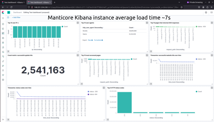
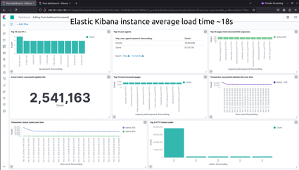

# Manticore Search Kibana Demo

  

## Table of Contents

- [Features](#features)
- [Prerequisites](#prerequisites)
- [Getting Started](#getting-started)
  - [Clone the Repository](#clone-the-repository)
  - [Configure the Environment](#configure-the-environment)
    - [Pre-Built Indexes](#pre-built-indexes)
    - [Generate a New Log File](#generate-a-new-log-file)
    - [Update Log Data](#update-log-data)
    - [Custom Ports](#custom-ports)
  - [Launch the Environment](#launch-the-environment)
  - [Import Kibana Objects](#import-kibana-objects)
    - [For the Elastic Kibana Instance](#for-the-elastic-kibana-instance)
    - [For the Manticore Kibana Instance](#for-the-manticore-kibana-instance)
  - [Explore the Dashboards](#explore-the-dashboards)
  - [Stopping the Environment](#stopping-the-environment)
- [Contributing](#contributing)
- [License](#license)
- [Support](#support)

This repository provides a ready-to-use setup to demonstrate the integration of [Manticore Search](https://manticoresearch.com/) with [Kibana](https://www.elastic.co/kibana). It also enables a performance comparison between two Kibana instances connected to Elasticsearch and Manticore, respectively. 

The demo utilizes a set of Kibana visualizations inspired by [this popular blog post](https://ruan.dev/blog/2019/04/02/setup-kibana-dashboards-for-nginx-log-data-to-understand-the-behavior), which is based on data from an Nginx access log file. The [kscarlett-generator](https://github.com/kscarlett/nginx-log-generator) tool is used to generate fake data for the log file.

## Prerequisites

Before getting started, ensure you have the following installed:

- [Git](https://git-scm.com/)
- [Docker Compose](https://docs.docker.com/compose/)

## Getting Started

### Clone the Repository

```bash
git clone https://github.com/manticoresoftware/kibana-demo.git
cd kibana-demo
```

### Configure the Environment

Edit the .env file to choose between using pre-built Elasticsearch and Manticore indexes or generating a new log file and building new indexes based on it.

#### Pre-Built Indexes

If you choose this option, prepared Elasticsearch and Manticore indexes will be downloaded from GitHub (data volume ~13GB). Note that this process may take some time. 

Set the following in .env:

```bash
REGENERATE_LOG=0
```


#### Generate a New Log File

If you choose to generate a new log file, data loading into Elasticsearch and Manticore may also take significant time, especially if a large number of log entries are configured.

Set the following in .env:

```bash
REGENERATE_LOG=1
LOG_ENTRY_COUNT=100000
```

#### Update Log Data

Additionally, you can update the indexes with new log entries to simulate real-time log behavior. Use the UPDATE_RATE option to define how many log entries are added per second. To disable this feature, set `UPDATE_RATE` to 0:

```bash
UPDATE_RATE=1
```

#### Custom ports

You can configure custom ports for the Elasticsearch and Manticore Kibana instances by setting these options in `.env`:

```bash
ES_KIBANA_PORT=5612
MANTICORE_KIBANA_PORT=5613
```

### Launch the environment

Run the startup script:

```bash
./start.sh
```

Wait until the log generation or index loading process is complete.

Verify the services are running:
- Kibana with Elasticsearch : http://localhost:5612
- Kibana with Manticore : http://localhost:5613

### Import Kibana objects

If you generated a new index, import the pre-built visualizations into Kibana.

For the Elasticsearch Kibana instance:

- Go to *Management > Saved objects* in the Kibana menu
- Click *Import* and select the `.kibana_objects.ndjson` file from the project folder.
- Refresh the Kibana window to apply the changes.


For the Manticore Kibana instance:

- Go to *Discover* in the Kibana menu
- Set `test` as the value for the `Index pattern` input field
- Click *Next step*
- Select `@timestamp` in the `Time Filter` select field
- Click *Create index pattern*


### Explore the Dashboards

Once the setup is complete, explore the imported dashboards and visualizations based on the indexed log data. Navigate to *Dashboard* or *Visualize* in the Kibana menu.

### Stopping the Environment

To stop and remove all containers, run:

```bash
docker-compose down
```

## Contributing

Contributions are welcome! Please open an issue or submit a pull request if you’d like to improve this project.

## License

This project is licensed under the MIT License.

## Support

For questions or issues, please visit the [Manticore Search community forums](https://forum.manticoresearch.com/) or open an issue in this repository.
