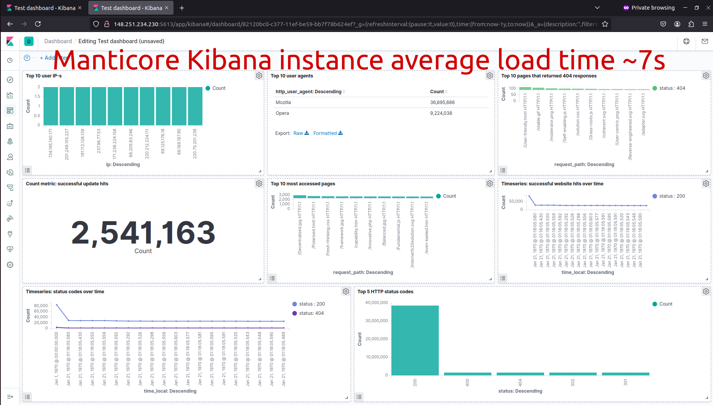
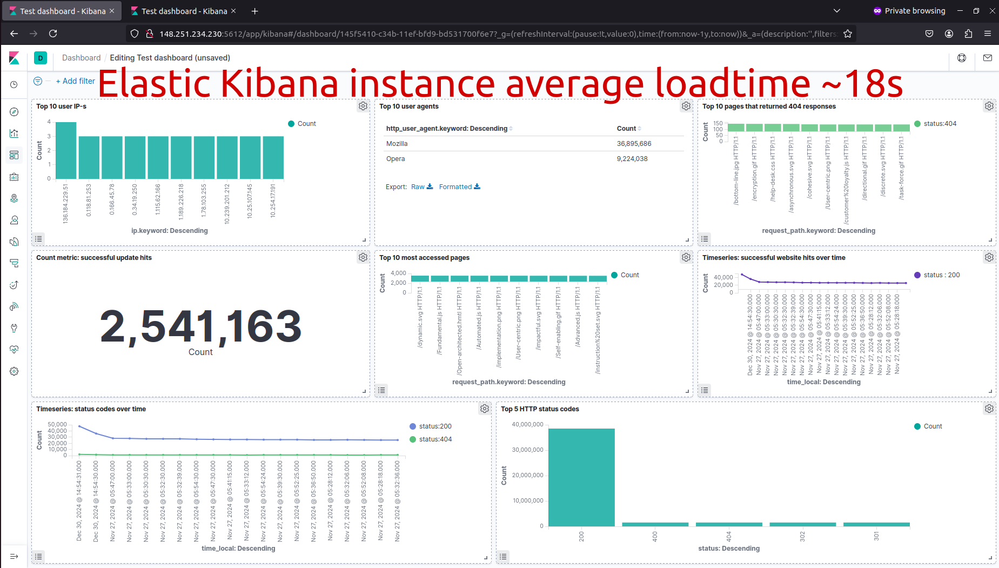

# Manticore Search Kibana Demo

This repository provides a ready-to-use setup to demonstrate the integration of [Manticore Search](https://manticoresearch.com/) with [Kibana](https://www.elastic.co/kibana). It also enables a performance comparison between two Kibana instances connected to Elasticsearch and Manticore, respectively. 

Here are our test results with approximately 40 million documents, showing that the same dashboard renders in 7 seconds with Manticore Search, compared to 18 seconds with Elasticsearch.

  

The demo utilizes a set of Kibana visualizations inspired by [this popular blog post](https://ruan.dev/blog/2019/04/02/setup-kibana-dashboards-for-nginx-log-data-to-understand-the-behavior), which is based on data from an Nginx access log file. The [kscarlett-generator](https://github.com/kscarlett/nginx-log-generator) tool is used to generate fake data for the log file.

## Prerequisites

Before getting started, ensure you have the following installed:

- [Git](https://git-scm.com/)
- [Docker Compose](https://docs.docker.com/compose/)
- Zip and Unzip tools

Command to install these packages in Ubuntu / Debian:
```
apt -y update && apt -y install git docker-compose zip unzip
```

## Getting Started

### Clone the Repository

```bash
git clone https://github.com/manticoresoftware/kibana-demo.git
cd kibana-demo
```

### Configure the Environment

Grant permissions for the Elasticsearch data folder:
```bash
chmod 777 es_data
```


#### Generate a New Log File

Edit the `.env` file to set how many log entries to generate. By default, this is 50 million entries.
Note that loading a large number of entries into Elasticsearch and Manticore can take time.

Set the following in `.env`:

```bash
LOG_ENTRY_COUNT=50000000
```

You can also make it add new log entries after the main volume is uploaded to mimic real-time logging. Use the `UPDATE_RATE` option to set how many log entries are added per second. To turn off this feature, set `UPDATE_RATE` to 0.  

```bash
UPDATE_RATE=1
```

#### Custom ports

You can configure custom ports for the Elasticsearch and Manticore Kibana instances by setting these options in `.env`:

```bash
ES_KIBANA_PORT=5612
MANTICORE_KIBANA_PORT=5613
```

### Launch the environment

Run the startup script:

```bash
./start.sh
```

Wait a few minutes for log generation and index loading to begin.

Verify the services are running:
- Elasticsearch Kibana: http://localhost:5612
- Manticore Kibana : http://localhost:5613

Choose `Explore on my own` on the Kibana start screen

### Import Kibana objects

Import the pre-built visualizations into Kibana to use for the generated data.

For the **Elasticsearch Kibana** instance:

- Go to *Management > Saved objects* in the Kibana menu
- Click *Import* and select the [kibana_objects.ndjson](https://raw.githubusercontent.com/manticoresoftware/kibana-demo/refs/heads/main/kibana_objects.ndjson) file from the root of this repository.
- Refresh the Kibana window to apply the changes.

For the **Manticore Kibana** instance:

- Go to *Discover* in the Kibana menu
- Set `test` as the value for the `Index pattern` input field
- Click *Next step*
- Select `@timestamp` in the `Time Filter` select field
- Click *Create index pattern*


### Explore the Dashboards

Once the setup is complete, explore the imported dashboards and visualizations based on the indexed log data. Navigate to *Dashboard* or *Visualize* in the Kibana menu.

After all log entries are loaded, you'll notice differences in dashboard load times between Manticore and Elasticsearch.
Here are our test results with about 40 million documents:  

  

### Stopping the Environment

To stop and remove all containers, run:

```bash
docker-compose down
```

## Limitations

- Currently, Kibana version 7.6.0 is tested and recommended. Other 7.x versions may work but could cause issues. Versions 8.x are not supported.
- The following Elasticsearch-specific field types are not supported:
  - [Spatial data types](https://www.elastic.co/guide/en/elasticsearch/reference/current/mapping-types.html#spatial_datatypes)
  - [Structured data types](https://www.elastic.co/guide/en/elasticsearch/reference/current/mapping-types.html#structured-data-types)
  - [Document ranking types](https://www.elastic.co/guide/en/elasticsearch/reference/current/mapping-types.html#document-ranking-types)
  - [Text search types](https://www.elastic.co/guide/en/elasticsearch/reference/current/mapping-types.html#text-search-types) (except for plain 'text')
  - [Relational data types](https://www.elastic.co/guide/en/elasticsearch/reference/current/mapping-types.html#object-types)
- Metric aggregation functions are limited to [those supported by Manticore](../Searching/Grouping.md#Aggregation-functions).
- The following Kibana tools are not supported:
  - Canvas
  - Maps
  - Metrics
  - Logs
  - Monitoring:
    - Uptime monitoring 
    - APM(Application Performance Monitoring)
    - SIEM(Security Information and Event Management)
    - Stack monitoring
  - ILM

## Contributing

Contributions are welcome! Please open an issue or submit a pull request if you’d like to improve this project.

## License

This project is licensed under the MIT License.

## Support

For questions or issues, please visit the [Manticore Search community forums](https://forum.manticoresearch.com/) or open an issue in this repository.
